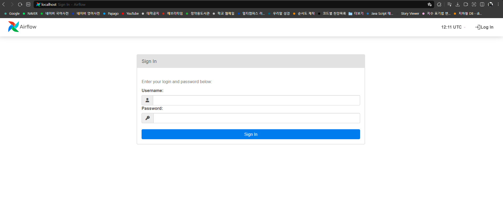
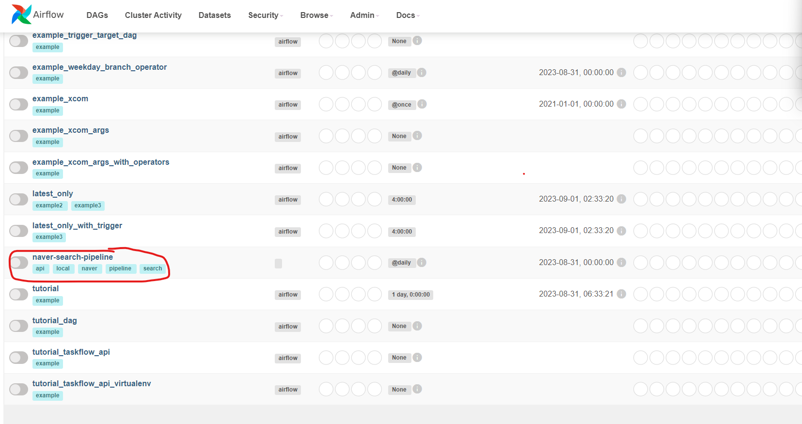
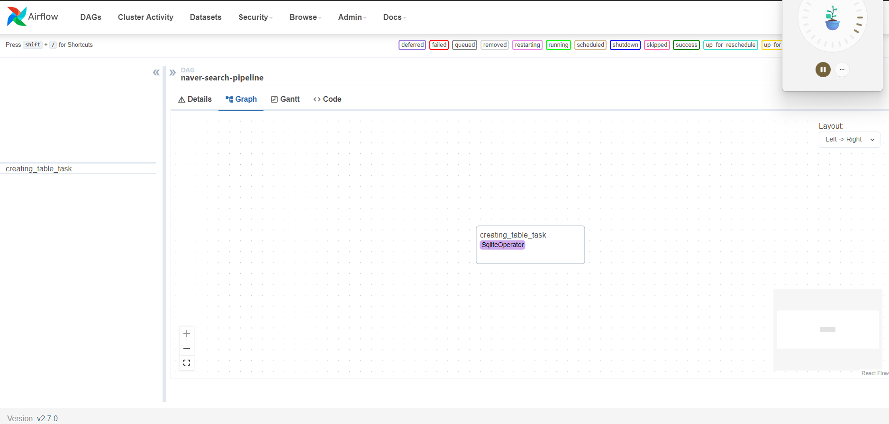
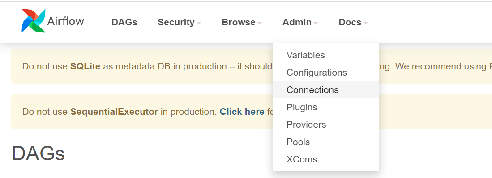
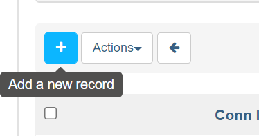
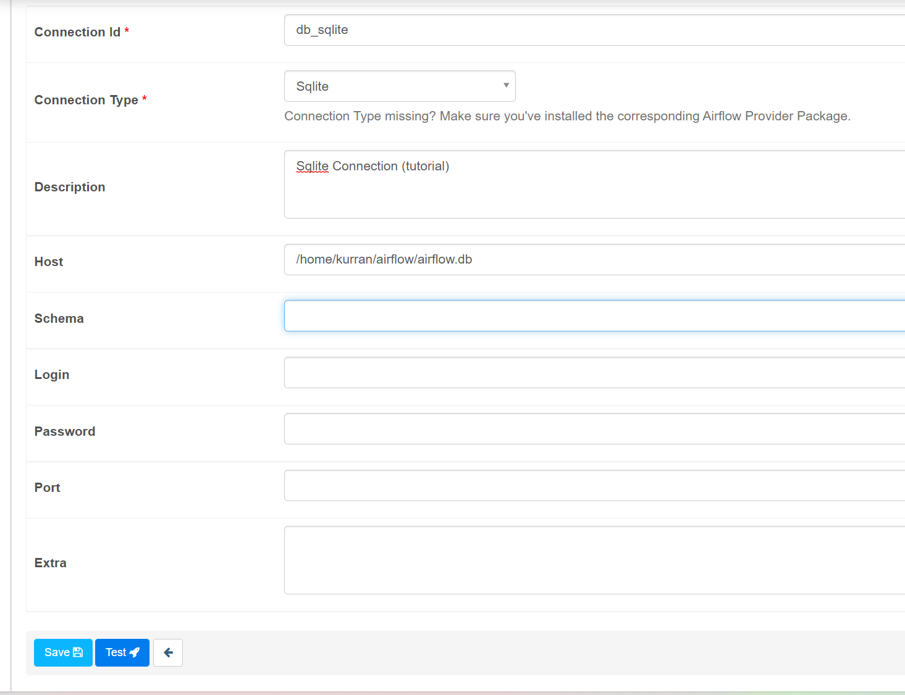

### 앞으로 계속 나올 용어와 개념들

- **워크플로우** : 작업들의 집합. 서로 종속되어 있다.
- **DAG** (=Directed Acyclic Graph - 방향이 있는 비순환 그래프 )
커다란 작업을 진행하는 과정을 말한다. Airflow의 핵심 구조이다. 
이 DAG는 한 프로젝트에 여러 개 존재할 수 있다.
- Task : 대그를 이루고 있는 단위 구성요

### Airflow 구성 요소

- Airflow 사용자 : 본인 또는 관리자
- 웹 서버 : 사용자가 작업을 관리하고 통제할 수 있도록 정리된 화면
- **스케줄러** : 워크플로우 시간 관리
- **Metastore** 📑 : 여러 대그 정보를 써놓은 파일철. 대그가 잘 진행되었는지, 중간에 어느 과정에서 망했는지, 성공했는지 등을 적어놓는다.
- **Executor** 👷 : 작업을 배치하는 작업 반장
- **Worker** 👩‍🔧 : 작업을 수행하는 일꾼
- **Operator** ⚙️ : 작업을 수행할 때 사용하는 기계. 공장장이 이런 기계들을 설계해서(파이썬 코드로) 공정 순서대로 엮어주면 한 대그가 완성된다.

Airflow는 실시간으로, 초단위로 진행되어야 하는 공정에는 적합하지 않다. 보석 공장처럼 하루 한 번, 일주일에 한 번 이렇게 진행되는 공정을 관리하는 데에 적합하다.

- 설치하기
    
    현재 내 파이썬 버전은 3.9.13 이므로,
    
    `conda create -n airflow_env python=3.9.13` 했다. 그런데
    
    아래의 경고 때문에
    
    ```powershell
    ==> WARNING: A newer version of conda exists. <==
    current version: 22.9.0
    latest version: 23.7.3
    Please update conda by running
    ```
    
    `conda update -n base -c defaults conda` 를 입력한다. 그리고 계속 이어나간다.
    
    `pip3 install apache-airflow` … 그런데
    
    결론 : 윈도우에는 직접 Airflow를 설치할 수 없다
    
    그래서 가상환경 소프트웨어를 찾아본다. VMware, VirtualBox 두 개가 있는데, 용량이 더 작은 후자를 선택했다.
    
    https://www.virtualbox.org/wiki/Downloads 여기서 다운받고, 설치옵션 만질 것 없이 쭉 간다.
    
    우분투를 설치하였다. 이젠… 리눅스 밭이 시작됐다. 우분투에 파이썬을 설치하자
    
    우클릭, 오픈 터미널 누르고 sudo apt install python 입력한다.
    
    그리고 python --version 입력하니 버전은 낮았으나 2.7.18이 잘 뜬것을 확인하고 pip install apache-airflow를 설치했지만 pip 인식 불가로 안됐다.
    
    그런데 똑똑한 우분투가 sudo apt install python3-pip 하라고 알려줘서 입력 한 후
    airflow를 설치했다.
    
    `mysqladmin -u root create testbook -p`
    
    E: mysqlclient 이 오류만 났는데 우분투가 `sudo apt install mysql-client-core-8.0` 하라고 했다.
    
    알약이랑 VirtureBox의 충돌로, 가상환경에서 하는게 화딱지가 났다…. 그래서 Microsoft Appstore로 가서 우분투를 다운받고, Window Linux 환경에서 실행했다.
    
    Window Powershell 실행 후
    
    ```powershell
    wsl --install --빼먹으면 안됨. 주의
    아래는 그 결과. ID : gloryword PW : 0075007
    
    PS C:\Users\dlwhd> wsl --install
    Ubuntu이(가) 이미 설치되어 있습니다.
    Ubuntu을(를) 시작하는 중...
    Installing, this may take a few minutes...
    Please create a default UNIX user account. The username does not need to match your Windows username.
    For more information visit: https://aka.ms/wslusers
    Enter new UNIX username: gloryword
    New password:
    Retype new password:
    passwd: password updated successfully
    작업을 완료했습니다.
    Installation successful!
    To run a command as administrator (user "root"), use "sudo <command>".
    See "man sudo_root" for details.
    
    Welcome to Ubuntu 22.04.2 LTS (GNU/Linux 5.15.90.1-microsoft-standard-WSL2 x86_64)
    
     * Documentation:  https://help.ubuntu.com
     * Management:     https://landscape.canonical.com
     * Support:        https://ubuntu.com/advantage
    
    This message is shown once a day. To disable it please create the
    /home/gloryword/.hushlogin file.
    ```
    
    그 후 Powershell 관리자 실행 후에 wsl -l -v 했을 시에, Ubuntu버전이 꼭 2로 나와야한다.
    
    시작→ wsl 검색 후 실행하니 바로 꺼지길래 검색. 원인은 기본값이 docker로 되어있어서 그렇다.
    
    powershell 키고 `wslconfig /setdefault Ubuntu` 입력.
    
    참고 : `wsl --list, wsl -l -v` 명령어로 현 상태 조회가능.
    
    ~~걍 안되겠다 젠장 powershell 누르고 wsl  --install로만 들어가자~~
    
    아니… wsl 누르면 경로 이상하게 나올텐데, 걍 cd 엔터 치면 된다.
    
    ```powershell
    gloryword@Doldari-Teenager:/mnt/c/WINDOWS/system32$ cd
    gloryword@Doldari-Teenager:~$
    ```
    
    이렇게 됨.
    
    [Install Docker Engine on Ubuntu](https://docs.docker.com/engine/install/ubuntu/)
    
    [[데이터 엔지니어링 with Airflow] 4강. 도커를 사용하여 Airflow 설치하기](https://www.youtube.com/watch?v=_6FaI70td34)
    
    이거 보고했다..
    
    powershell에서는 
    
    `sudo service docker start`
    
    컴 키면 항상 해줘야하는 명령어임.
    
    이제 드디어 Airflow 설치하는데, 아래 보고 했다.
    
    [Running Airflow in Docker — Airflow Documentation](https://airflow.apache.org/docs/apache-airflow/stable/howto/docker-compose/index.html)
    
    나중에 영상보기 귀찮을까봐 글로 남겨둠. 위 사이트 내용 추출한거임.
    
    ```powershell
    curl -LfO 'https://airflow.apache.org/docs/apache-airflow/2.7.0/docker-compose.yaml'
    
    mkdir -p ./dags ./logs ./plugins ./config 이거 먼저 실행하고
    echo -e "AIRFLOW_UID=$(id -u)" > .env 이거 실행하기.
    아래는 실제 결과 기록
    
    gloryword@Doldari-Teenager:~$ mkdir -p ./dags ./logs ./plugins ./config
    gloryword@Doldari-Teenager:~$ ls -al
    total 60
    drwxr-x--- 7 gloryword gloryword  4096 Aug 31 20:54 .
    drwxr-xr-x 3 root      root       4096 Aug 31 20:30 ..
    -rw------- 1 gloryword gloryword    11 Aug 31 20:41 .bash_history
    -rw-r--r-- 1 gloryword gloryword   220 Aug 31 20:30 .bash_logout
    -rw-r--r-- 1 gloryword gloryword  3771 Aug 31 20:30 .bashrc
    drwx------ 2 gloryword gloryword  4096 Aug 31 20:30 .cache
    -rw-r--r-- 1 gloryword gloryword     0 Aug 31 20:30 .motd_shown
    -rw-r--r-- 1 gloryword gloryword   807 Aug 31 20:30 .profile
    -rw-r--r-- 1 gloryword gloryword     0 Aug 31 20:42 .sudo_as_admin_successful
    -rw------- 1 gloryword gloryword   760 Aug 31 20:52 .viminfo
    drwxr-xr-x 2 gloryword gloryword  4096 Aug 31 20:54 config
    drwxr-xr-x 2 gloryword gloryword  4096 Aug 31 20:54 dags
    -rw-r--r-- 1 gloryword gloryword 11783 Aug 31 20:51 docker-compose.yaml
    drwxr-xr-x 2 gloryword gloryword  4096 Aug 31 20:54 logs
    drwxr-xr-x 2 gloryword gloryword  4096 Aug 31 20:54 plugins
    gloryword@Doldari-Teenager:~$ echo -e "AIRFLOW_UID=$(id -u)" > .env
    gloryword@Doldari-Teenager:~$ ls -al
    total 64
    drwxr-x--- 7 gloryword gloryword  4096 Aug 31 20:55 .
    drwxr-xr-x 3 root      root       4096 Aug 31 20:30 ..
    -rw------- 1 gloryword gloryword    11 Aug 31 20:41 .bash_history
    -rw-r--r-- 1 gloryword gloryword   220 Aug 31 20:30 .bash_logout
    -rw-r--r-- 1 gloryword gloryword  3771 Aug 31 20:30 .bashrc
    drwx------ 2 gloryword gloryword  4096 Aug 31 20:30 .cache
    -rw-r--r-- 1 gloryword gloryword    17 Aug 31 20:55 .env
    -rw-r--r-- 1 gloryword gloryword     0 Aug 31 20:30 .motd_shown
    -rw-r--r-- 1 gloryword gloryword   807 Aug 31 20:30 .profile
    -rw-r--r-- 1 gloryword gloryword     0 Aug 31 20:42 .sudo_as_admin_successful
    -rw------- 1 gloryword gloryword   760 Aug 31 20:52 .viminfo
    drwxr-xr-x 2 gloryword gloryword  4096 Aug 31 20:54 config
    drwxr-xr-x 2 gloryword gloryword  4096 Aug 31 20:54 dags
    -rw-r--r-- 1 gloryword gloryword 11783 Aug 31 20:51 docker-compose.yaml
    drwxr-xr-x 2 gloryword gloryword  4096 Aug 31 20:54 logs
    drwxr-xr-x 2 gloryword gloryword  4096 Aug 31 20:54 plugins
    ```
    
    참고로 `docker compose up airflow-init`, `docker compose up airflow-init`는 꼭 sudo가 들어가야 한다.
    
    ```powershell
    sudo docker compose up airflow-init 하고 좀 시간 걸리고 코드 0이 반환되며 성공.
    sudo docker compose up 치면 뭔가 엄청 뜬다. 그거 끄면 프로그램 종료되니까 이 상태로
    wsl 키고
    sudo docker ps 입력하면 Airflow를 띄우는데 필요한 컨테이너 목록들을 볼 수 있다.
    
    gloryword@Doldari-Teenager:~$ sudo docker ps
    [sudo] password for gloryword:
    CONTAINER ID   IMAGE                  COMMAND                  CREATED          STATUS                    PORTS                                       NAMES
    774eb370367a   apache/airflow:2.7.0   "/usr/bin/dumb-init …"   6 minutes ago    Up 6 minutes (healthy)    8080/tcp                                    gloryword-airflow-worker-1
    ed6d8d0bb9ab   apache/airflow:2.7.0   "/usr/bin/dumb-init …"   6 minutes ago    Up 6 minutes (healthy)    8080/tcp                                    gloryword-airflow-scheduler-1
    364c3b64678f   apache/airflow:2.7.0   "/usr/bin/dumb-init …"   6 minutes ago    Up 6 minutes (healthy)    8080/tcp                                    gloryword-airflow-triggerer-1
    9e7b56d69904   apache/airflow:2.7.0   "/usr/bin/dumb-init …"   6 minutes ago    Up 6 minutes (healthy)    0.0.0.0:8080->8080/tcp, :::8080->8080/tcp   gloryword-airflow-webserver-1
    a111ad32c0a8   postgres:13            "docker-entrypoint.s…"   11 minutes ago   Up 11 minutes (healthy)   5432/tcp                                    gloryword-postgres-1
    4567720524cc   redis:latest           "docker-entrypoint.s…"   11 minutes ago   Up 11 minutes (healthy)   6379/tcp                                    gloryword-redis-1
    ```
    
    이제 [localhost](http://localhost):8080 를 주소에 입력해본다…. : 두개가 아니라 한개다.
    
    
    
    진짜 눈물난다. 5시간 넘게 걸렸다.
    
    ID,PW의 기본값은 airflow 로 동일하다.

naver_search_pipeline.py를 만들고 아래의 코드를 붙여넣고, Airflow 웹 서버로 간다.

```python
# 필요한 모듈 Import
from datetime import datetime
from airflow import DAG
import json
# from preprocess.naver_preprocess import preprocessing 원래 있었는데... 무시하고 하자.

# 사용할 Operator Import
from airflow.providers.sqlite.operators.sqlite import SqliteOperator
from airflow.providers.http.sensors.http import HttpSensor
from airflow.providers.http.operators.http import SimpleHttpOperator
from airflow.operators.python import PythonOperator
from airflow.operators.bash import BashOperator
from airflow.operators.email import EmailOperator

# 디폴트 설정
default_args = {
    "start_date": datetime(2023, 1, 1) # 2022년 1월 1일 부터 대그 시작 --> 현재는 22년 7월이므로 대그를 실행하면 무조건 한 번은 돌아갈 것
}

# 본인이 발급받은 키를 넣으세요
NAVER_CLI_ID = "EmdlUXsc4CuKNm_kxYKS"
NAVER_CLI_SECRET = "dSLoIEmMgy"

def _complete():
    print("네이버 검색 DAG 완료")

# DAG 틀 설정
with DAG(
    dag_id="naver-search-pipeline",
    # crontab 표현 사용 가능 https://crontab.guru/
    schedule_interval="@daily", 
    default_args=default_args,
    # 태그는 원하는대로
    tags=["naver", "search", "local", "api", "pipeline"],
    # catchup을 True로 하면, start_date 부터 현재까지 못돌린 날들을 채운다
    catchup=False) as dag:

    pass
```



눌러서 들어간다. 그리고 다음 코드를 추가한다. (윗 코드 pass 바로 아래 붙여넣기 하면 됨.)

```python
# 네이버 API로 지역 식당을 검색할 것이다. 
    # 지역 식당명, 주소, 카테고리, 설명, 링크를 저장할 것이므로 다음과 같이 테이블을 구성한다.
    creating_table = SqliteOperator(
        task_id="creating_table_task",
        sqlite_conn_id="db_sqlite", # 웹UI에서 connection을 등록해줘야 함.
        # naver_search_result 라는 테이블이 없는 경우에만 만들도록 IF NOT EXISTS 조건을 넣어주자.
        sql='''
            CREATE TABLE IF NOT EXISTS naver_search_result( 
                title TEXT,
                address TEXT,
                category TEXT,
                description TEXT,
                link TEXT
            )
        '''
    )
```

이렇게 하고 Graph에 들어가보면 다음과 같이 나온다. (집중세션 무시~ 그 만큼 열심히 했다는)



여기서 끝난 것이 아니라, 내 sqlite 인스턴스와 연결하려면 웹서버에 들어가서 등록해줘야 한다. Admin의 Connections 클릭.



그리고



아까 *sqlite_conn_id*="db_sqlite" 라고 입력했던 걸 이제 쓸거다.



그런데 여기서… 공식문서에서 Sqlite는 권장하지 않고 Mysql을 사용하라고 해서

[airflow-docker-mysql-naver_api](https://velog.io/@alsrb3272/airflow-docker-mysql-naverapi#3--mysql-및-dbeaver-설치)

이 곳을 참조했다. 그리고 샘플 DAGS 보기 더러워서 지워줬다. 

docker-compose.yaml에 들어가서 AIRFLOW__CORE__LOAD_EXAMPLES: 'true’ → ‘false’ 로 변경.

DBeaver 설치경로 C:\Program Files\DBeaver

MySQL root의 Port 번호는 3306